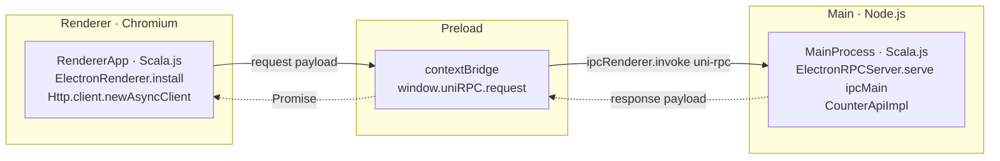

# Electron Tutorial: Setup from Scratch

A step-by-step walkthrough that builds a small **Electron desktop app** with Uni and Scala.js from
an empty directory. The UI (renderer) calls a service in the main process using Uni's
[RPC](/http/rpc), tunneled over Electron IPC — no HTTP server, no open ports.

By the end you'll have a counter window whose **+1 / +10 / Reset** buttons each make a real RPC call
to the main process. For the API reference behind each piece, see [Desktop Apps
(Electron)](/http/electron). The finished project is in
[`examples/electron-app`](https://github.com/wvlet/uni/tree/main/examples/electron-app).

## What you're building

Electron runs three contexts; Uni occupies two and a tiny hand-written script bridges the third:



## Prerequisites

- JDK 11+ and `sbt` on your `PATH` (the Scala.js Vite plugin shells out to `sbt`)
- Node.js 20+ and `pnpm` (or npm)

## Step 1: the sbt build

Three Scala.js modules: a shared `api`, the `main` process, and the `renderer`. All emit ES modules
(so Vite can bundle them) and export functions instead of running a `main`:

```scala
// build.sbt
val uniVersion = sys.props.getOrElse("uni.version", "__UNI_VERSION__")
val scala3     = "3.8.4"

ThisBuild / scalaVersion := scala3

lazy val commonSettings = Seq(
  scalaVersion := scala3,
  scalaJSLinkerConfig ~= { _.withModuleKind(ModuleKind.ESModule) },
  scalaJSUseMainModuleInitializer := false,
  libraryDependencies += "org.wvlet.uni" %%% "uni" % uniVersion
)

lazy val api      = project.in(file("api")).enablePlugins(ScalaJSPlugin).settings(commonSettings)
lazy val main     = project.in(file("main")).enablePlugins(ScalaJSPlugin).settings(commonSettings).dependsOn(api)
lazy val renderer = project.in(file("renderer")).enablePlugins(ScalaJSPlugin).settings(commonSettings).dependsOn(api)
```

```scala
// project/plugins.sbt
addSbtPlugin("org.scala-js" % "sbt-scalajs" % "1.22.0")
```

```
// project/build.properties
sbt.version=1.12.13
```

## Step 2: the shared service

Define the RPC service once; both processes depend on `api`. Returning `Rx[A]` keeps calls
asynchronous, which suits IPC:

```scala
// api/src/main/scala/example/api/CounterApi.scala
package example.api

import wvlet.uni.rx.Rx

case class CounterState(value: Int)

trait CounterApi:
  def get(): Rx[CounterState]
  def increment(amount: Int): Rx[CounterState]
  def reset(): Rx[CounterState]
```

## Step 3: the main process

Implement the service and register it on Electron's `ipcMain`. `ipcMain` is **passed in as a value**
— this Scala module never has to `require("electron")`, which keeps it free of bundler coupling:

```scala
// main/src/main/scala/example/main/MainProcess.scala
package example.main

import example.api.{CounterApi, CounterState}
import wvlet.uni.electron.ElectronRPCServer
import wvlet.uni.http.rpc.RPCRouter
import wvlet.uni.rx.Rx
import scala.scalajs.js
import scala.scalajs.js.annotation.JSExportTopLevel

class CounterApiImpl extends CounterApi:
  private var value = 0
  def get(): Rx[CounterState]                  = Rx.single(CounterState(value))
  def increment(amount: Int): Rx[CounterState] = { value += amount; Rx.single(CounterState(value)) }
  def reset(): Rx[CounterState]                = { value = 0; Rx.single(CounterState(value)) }

object MainProcess:
  @JSExportTopLevel("wireMainProcess")
  def wireMainProcess(ipcMain: js.Dynamic): Unit =
    ElectronRPCServer.serve(ipcMain, RPCRouter.of[CounterApi](CounterApiImpl()))
```

The Electron main entry (plain JS) creates the window and hands `ipcMain` to the Scala module once
the app is ready:

```js
// src/main/index.js
import { app, BrowserWindow, ipcMain } from 'electron'
import { join } from 'node:path'
import { wireMainProcess } from 'scalajs:main.js'

function createWindow() {
  const win = new BrowserWindow({
    width: 480,
    height: 380,
    webPreferences: {
      // electron-vite emits an ESM preload (.mjs) because package.json is "type": "module".
      preload: join(__dirname, '../preload/index.mjs'),
      contextIsolation: true,
      nodeIntegration: false,
      // ESM preloads require the sandbox off; the contextBridge boundary still isolates the renderer.
      sandbox: false
    }
  })
  if (process.env.ELECTRON_RENDERER_URL) win.loadURL(process.env.ELECTRON_RENDERER_URL)
  else win.loadFile(join(__dirname, '../renderer/index.html'))
}

app.whenReady().then(() => {
  wireMainProcess(ipcMain) // register the RPC services before opening any window
  createWindow()
  app.on('activate', () => { if (BrowserWindow.getAllWindows().length === 0) createWindow() })
})
app.on('window-all-closed', () => { if (process.platform !== 'darwin') app.quit() })
```

## Step 4: the preload bridge

The single function the renderer transport expects. Context isolation stays on — the renderer never
gets direct Node access:

```js
// src/preload/index.js
import { contextBridge, ipcRenderer } from 'electron'

contextBridge.exposeInMainWorld('uniRPC', {
  request: (payload) => ipcRenderer.invoke('uni-rpc', payload)
})
```

## Step 5: the renderer

Call `ElectronRenderer.install()` once at startup; afterward every async client (including generated
RPC stubs) rides over IPC. Here we build the client directly from the shared trait:

```scala
// renderer/src/main/scala/example/renderer/RendererApp.scala
package example.renderer

import example.api.{CounterApi, CounterState}
import org.scalajs.dom
import wvlet.uni.electron.ElectronRenderer
import wvlet.uni.http.Http
import wvlet.uni.http.rpc.RPCClient
import wvlet.uni.surface.Surface
import scala.scalajs.js.annotation.JSExportTopLevel

object RendererApp:
  private val rpc         = RPCClient.build(Surface.of[CounterApi], Surface.methodsOf[CounterApi])
  private lazy val client = Http.client.newAsyncClient

  @JSExportTopLevel("main")
  def main(): Unit =
    ElectronRenderer.install() // wire window.uniRPC as the HTTP channel factory
    val display = dom.document.getElementById("counter-value")
    def show(s: CounterState): Unit = display.textContent = s.value.toString

    rpc.callAsync[CounterState](client, "get", Seq.empty).run(show)
    // wire buttons → rpc.callAsync[CounterState](client, "increment", Seq(1)).run(show), etc.
```

The renderer HTML loads the Scala.js module and provides the mount point:

```html
<!-- src/renderer/index.html -->
<!doctype html>
<html lang="en">
  <head>
    <meta charset="UTF-8" />
    <title>Uni Electron Counter</title>
  </head>
  <body>
    <p id="counter-value">…</p>
    <script type="module" src="./index.js"></script>
  </body>
</html>
```

```js
// src/renderer/index.js
import { main } from 'scalajs:main.js'
main()
```

::: tip Styling
The example styles the renderer with [Tailwind CSS](https://tailwindcss.com/) v4 via
`@tailwindcss/vite`, pointing `@source` at the Scala sources so Tailwind finds the `className`
strings used in `RendererApp.scala`. It's optional — plain CSS works too.
:::

## Step 6: the build pipeline

[`electron-vite`](https://electron-vite.org/) drives the three Vite builds (main / preload /
renderer). [`@scala-js/vite-plugin-scalajs`](https://www.scala-js.org/doc/tutorial/scalajs-vite.html)
links a Scala.js project and exposes it as `import 'scalajs:main.js'`; its `projectID` picks the sbt
project:

```js
// electron.vite.config.mjs
import { defineConfig, externalizeDepsPlugin } from 'electron-vite'
import scalaJSPlugin from '@scala-js/vite-plugin-scalajs'

export default defineConfig({
  main:     { plugins: [externalizeDepsPlugin(), scalaJSPlugin({ cwd: '.', projectID: 'main' })] },
  preload:  { plugins: [externalizeDepsPlugin()] },
  renderer: { plugins: [scalaJSPlugin({ cwd: '.', projectID: 'renderer' })] }
})
```

```json
// package.json
{
  "name": "uni-electron-example",
  "type": "module",
  "main": "out/main/index.js",
  "scripts": {
    "dev": "electron-vite dev",
    "build": "electron-vite build",
    "package": "electron-vite build && electron-builder"
  },
  "devDependencies": {
    "@scala-js/vite-plugin-scalajs": "^1.0.0",
    "electron": "^34.0.0",
    "electron-builder": "^25.1.8",
    "electron-vite": "^2.3.0",
    "vite": "^5.4.11"
  },
  "pnpm": { "onlyBuiltDependencies": ["electron", "esbuild"] }
}
```

## Step 7: run and package

```bash
pnpm install
pnpm dev       # compiles Scala.js, starts the renderer dev server, launches Electron (hot reload)
```

Click the buttons — each is an RPC call to the main process, which owns the counter. To ship
installers (dmg / nsis / AppImage via [electron-builder](https://www.electron.build/)):

```bash
pnpm package   # → installers under dist/
```

## Gotchas worth knowing

- **`scalajs-java-securerandom`** — Uni's Scala.js code reaches `java.security.SecureRandom` (via
  ULID in the serialization layer). Recent Uni releases pull it in transitively; on older releases
  add it yourself, or linking fails with "non-existent class java.security.SecureRandom":

  ```scala
  libraryDependencies +=
    ("org.scala-js" %%% "scalajs-java-securerandom" % "1.0.0").cross(CrossVersion.for3Use2_13)
  ```

- **ESM preload path** — under `"type": "module"`, electron-vite emits the preload as
  `index.mjs`. Point `preload:` at `../preload/index.mjs`, and set `sandbox: false` (ESM preloads
  don't load in a sandboxed renderer; `contextIsolation` still isolates it).

- **Renderer is async-only** — a sandboxed renderer has no synchronous IPC, so use
  `Http.client.newAsyncClient`. `newSyncClient` throws.

## Where to go next

- [Desktop Apps (Electron)](/http/electron) — the transport reference (channels, server, marshaling).
- [RPC](/http/rpc) — defining services, generated clients, error handling.
- [`examples/electron-app`](https://github.com/wvlet/uni/tree/main/examples/electron-app) — the
  complete, runnable project this tutorial distills.
