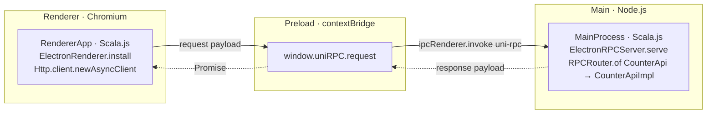

# Uni Electron Example — a counter app over IPC

A minimal [Electron](https://www.electronjs.org/) desktop app built with **Uni + Scala.js**. The UI
(renderer) calls a service running in the main process using Uni's RPC, tunneled over Electron IPC —
no HTTP server, no open ports.



The same `CounterApi` trait (in `api/`) is shared by both sides: the main process *implements* it,
the renderer *calls* it. Uni's `RPCRouter` / `RPCClient` handle (de)serialization; the Electron IPC
transport (`wvlet.uni.electron`) carries the JSON envelope across the process boundary.

## Layout

| Path                  | What it is                                                              |
| --------------------- | ---------------------------------------------------------------------- |
| `api/`                | Scala.js: shared RPC service trait + models (`CounterApi`)              |
| `main/`               | Scala.js: service impl + `ElectronRPCServer.serve(ipcMain, ...)`        |
| `renderer/`           | Scala.js: UI + RPC client (`ElectronRenderer.install()`)               |
| `src/main/index.js`   | Electron main entry — creates the window, hands `ipcMain` to Scala      |
| `src/preload/index.js`| `contextBridge` bridge: `window.uniRPC.request → ipcRenderer.invoke`    |
| `src/renderer/`       | `index.html` + the JS entry that imports the Scala.js renderer module   |
| `electron.vite.config.mjs` | electron-vite + `vite-plugin-scalajs` (links the `main`/`renderer` sbt projects) |
| `electron-builder.yml`| Packaging config (dmg / nsis / AppImage)                               |

## Prerequisites

- JDK 11+ and `sbt` on your `PATH` (the Scala.js plugin shells out to `sbt`)
- Node.js 18+ and `pnpm` (or npm)
- A locally published Uni snapshot for Scala.js:

  ```bash
  # from the Uni repo root
  ./sbt projectJS/publishLocal
  ```

  Then point the example at that version (see the value printed by `show version`):

  ```bash
  export SBT_OPTS="-Duni.version=<the-snapshot-version>"
  ```

  `build.sbt` defaults `uni.version` to a snapshot; override it to match your local publish.

## Develop

```bash
pnpm install
pnpm dev          # electron-vite: compiles Scala.js, starts the renderer dev server, launches Electron
```

Click **+1 / +10 / Reset** — each click is an RPC call to the main process, which owns the counter.

## Package

```bash
pnpm package      # electron-vite build, then electron-builder → dist/
```

## How the transport works

- **Renderer** — `ElectronRenderer.install()` registers an `HttpChannelFactory` whose async channel
  serializes each request to a plain object and calls `window.uniRPC.request(payload)`. Every
  `Http.client.newAsyncClient` (and generated RPC `AsyncClient`) then rides over IPC unchanged.
- **Preload** — exposes exactly one function via `contextBridge`, forwarding to
  `ipcRenderer.invoke('uni-rpc', payload)`. Context isolation stays on.
- **Main** — `ElectronRPCServer.serve(ipcMain, routers*)` registers `ipcMain.handle('uni-rpc', ...)`,
  dispatches through Uni's transport-neutral `RPCDispatcher`, and resolves the response payload.

See the [Electron guide](../../docs/guide/electron.md) for the full reference.
